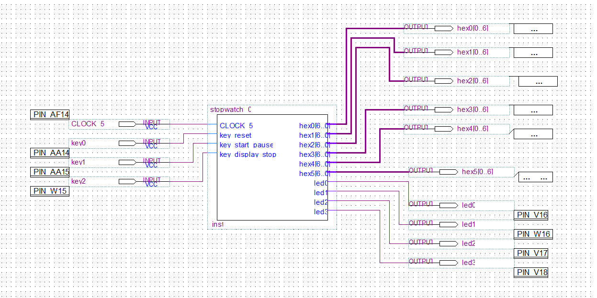
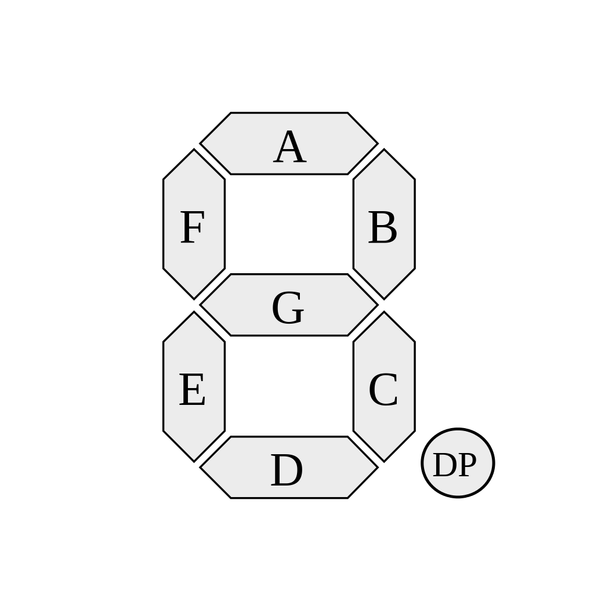
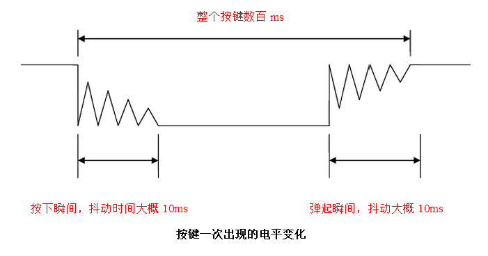

# 基于Verilog和FPGA的多功能秒表设计-实验报告 #

* 学号: 518021911058
* 姓名：沈瑜石

## 实验目的

1. 初步掌握利用Verilog硬件描述语言进行逻辑功能设计的原理和方法。
2. 理解和掌握运用大规模可编程逻辑器件进行逻辑设计的原理和方法。
3. 理解硬件实现方法中的并行性，联系软件实现方法中的并发性。
4. 理解硬件和软件是相辅相成、并在设计和应用方法上的优势互补的特点。
5. 本实验学习积累的Verilog硬件描述语言和对FPGA/CPLD的编程操作，是进行后续《计算机组成原理》部分课程实验，设计实现计算机逻辑的基础

## 实验仪器与平台

* 硬件：DE1-SoC实验板
* 软件：AlteraQuartusII13.

## 实验内容
1. 运用 Verilog 硬件描述语言，基于 DE1-SOC 实验板，设计实现一个具有较多
功能的计时秒表。
2. 要求将 6 个数码管设计为具有“分：秒：毫秒”显示，按键的控制动作有：
“计时复位”、“计数/暂停”、“显示暂停/显示继续”等。功能能够满足马拉
松或长跑运动员的计时需要。
3. 利用示波器观察按键的抖动，设计按键电路的消抖方法。
4. 在实验报告中详细报告自己的设计过程、步骤及 Verilog 代码。
-------------------------------------------------------------
### 顶层设计

* 只把stopwatch主模块转化为 Symbol File，数码管译码器，消抖模块等都在stopwatch模块中通过代码的方式连接。
* stopwatch的CLOCK_50引脚输入板子上的时钟，3个key引脚输入3个按钮。
* stopwatch的6个hex引脚输出数码管对应的数字格式，4个led引脚只做调试用，最终版本没有用到。
-------------------------------------------------------------
### 定义全局时钟
```Verilog
create_clock -name "CLOCK_50" -period 20.000ns [get_ports {CLOCK_50}]
derive_pll_clocks
derive_clock_uncertainty
```
* 定义一个名为 **CLOCK_50**，频率为50MHz的时钟
-------------------------------------------------------------
### 数码管译码模块
```Verilog
module sevenseg ( data, ledsegments);
input [3:0] data;
output ledsegments;
reg [6:0] ledsegments;
always @ (*)
  case(data)
    0: ledsegments = 7'b000_0001;
    1: ledsegments = 7'b100_1111;
    2: ledsegments = 7'b001_0010;
    3: ledsegments = 7'b000_0110;
    4: ledsegments = 7'b100_1100;
    5: ledsegments = 7'b010_0100;
    6: ledsegments = 7'b010_0000;
    7: ledsegments = 7'b000_1111;
    8: ledsegments = 7'b000_0000;
    9: ledsegments = 7'b000_0100;
    default: ledsegments = 7'b111_1111;  // 其它值时全灭。
  endcase
endmodule
```
<style>
    .myBox {
        display: flex;
        flex-wrap: wrap;
    }
    .myItem {
        flex-basis: 50%;
    }
</style>
<div class="myBox">
    <span class="myItem">
        
    </span>
    <span>
        <ul class="myItem">
            <li>组合逻辑</li>
            <li>对于每一位，0为显示，1为不显示</li>
            <li>按照7位bit对应数码管的显示，把4位数字转换成7位</li>
            <li>输入不是0~9时，显示全黑</li>
        </ul>
    </span>
</div>

-------------------------------------------------------------
### 防抖模块
```Verilog
module jitter_eliminater(CLOCK_50, in, out);
input CLOCK_50, in;
output out;
reg [31:0] wait_n;
reg [1:0]status;
reg out;

initial
  begin
    wait_n = 0;
    status = 0;
  end

always @(posedge CLOCK_50)
  if (out)
    out <= 0;
  else if (status == 1 || status == 3)
    if (wait_n >= 500000)
      begin
        wait_n <= 0;
        if (status == 1)
          if (in)
            begin
              status <= 2;
              out <= 1;
            end
          else
            status <= 0;
        else if (!in) //status == 3
          status <= 0;
        else
          status <= 2;
      end
    else
      wait_n <= wait_n + 1;
  else if (status == 0 && in)
    status <= 1;
  else if (status == 2 && !in)
    status <= 3;

endmodule

```


* 输入为全局时钟 **CLOCK_50**，按钮输入 **in**（1为按下，0为抬起）
* 输出 **out** 为防抖后的按钮输入
* 防抖的原理是：检测到按钮按下后开始计时，10ms后再次检测是否按下，如果是则确认按钮按下，**out** 设为1，下一次上升沿就重置为0，否则还是没有按下。按钮抬起时也一样，但不用发出out信号。
* 具体的实现是维护一个状态 **status**，0为没有按下，1为等待检测10ms后是否按下，2为按下了，3为等待检测10ms后是否放开。
-------------------------------------------------------------
### 主模块
### 模块与变量定义
```Verilog
module stopwatch_01(CLOCK_50, key_reset_, key_start_pause_, key_display_stop_,
                    hex0, hex1, hex2, hex3, hex4, hex5,
                    led0, led1, led2, led3 );
input CLOCK_50,key_reset_, key_start_pause_, key_display_stop_;
output [6:0] hex0, hex1, hex2, hex3, hex4, hex5;
output led0, led1, led2, led3;
// reg led0, led1, led2, led3;

reg [3:0] minute_display_high;
reg [3:0] minute_display_low;
reg [3:0] second_display_high;
reg [3:0] second_display_low;
reg [3:0] msecond_display_high;
reg [3:0] msecond_display_low;

reg [3:0] minute_counter_high;
reg [3:0] minute_counter_low;
reg [3:0] second_counter_high;
reg [3:0] second_counter_low;
reg [3:0] msecond_counter_high;
reg [3:0] msecond_counter_low;

reg [31:0] counter_50M;
reg [1:0] status;
reg time_flush;
reg display_flush;
reg reset_flush;

wire key_reset, key_start_pause, key_display_stop;

initial
  begin
    time_flush = 0;
    display_flush = 0;
    reset_flush = 1;
    counter_50M = 0;
    status = 0;
  end

sevenseg LED8_minute_display_high ( minute_display_high, hex5 );
sevenseg LED8_minute_display_low ( minute_display_low, hex4 );
sevenseg LED8_second_display_high( second_display_high, hex3 );
sevenseg LED8_second_display_low ( second_display_low, hex2 );
sevenseg LED8_msecond_display_high( msecond_display_high, hex1 );
sevenseg LED8_msecond_display_low ( msecond_display_low, hex0 );

jitter_eliminater key_reset_je (CLOCK_50, ~key_reset_, key_reset);
jitter_eliminater key_start_pause_je (CLOCK_50, ~key_start_pause_, key_start_pause);
jitter_eliminater key_display_stop_je (CLOCK_50, ~key_display_stop_, key_display_stop);

......

endmodule
```
* stopwatch模块定义6个counter和6个display分别作为秒表的计时和显示内容
* **status** 为秒表的状态，一共3个，0为停止状态，1为计时且显示状态，2为计时但不显示状态。
* 3个flush为改变display和counter的信号。**time_flush**为因为时间刷新counter，display。**display_flush**为因为status2刷新display。**reset_flush**为因为status0重置display和counter。
* display通过sevenseg模块输出到wire hex（此为组合逻辑）。
* 原始输入的key取反（因为原始输入按下为0）后通过jitter_eliminater输出到防抖后的key。


### 按键控制进程 ####
```Verilog
  if (display_flush || reset_flush)
    begin
      display_flush <= 0;
      reset_flush <= 0;
    end
  else if (key_reset)
    begin
      status <= 0;
      reset_flush <= 1;
    end
  else if (key_start_pause)
    if (status == 0 || status == 2)
      status <= 1;
    else //status == 1
      status <= 0;
  else if (key_display_stop)
    if (status == 1)
      status <= 2;
    else if (status == 2)
      display_flush <= 1;
      display_flush <= 1;
```
* 这个进程根据按钮输入，设置 **status** 和 **display_flush** 信号

### 100Hz时钟进程 ####
```Verilog
always @(posedge CLOCK_50)
  if (time_flush)
    begin
      time_flush <= 0;
      counter_50M <= 0;
    end
  else if (status == 1 || status == 2)
    if (counter_50M >= 500000)
      begin
        time_flush <= 1;
      end
    else
      counter_50M <= counter_50M + 1;
  else //status == 0
    counter_50M <= 0;
```
* 这个进程根据全局时钟 **CLOCK_50** 设置 **clk**信号和 **time_flush**信号

### 更新display进程 ####
```Verilog
always @(posedge time_flush or posedge display_flush or posedge reset_flush)
  if (reset_flush)
    begin
      msecond_display_low <= 0;
      msecond_display_high <= 0;
      second_display_low <= 0;
      second_display_high <= 0;
      minute_display_low <= 0;
      minute_display_high <= 0;
    end
  else if (display_flush)
    begin
      msecond_display_low <= msecond_counter_low;
      msecond_display_high <= msecond_counter_high;
      second_display_low <= second_counter_low;
      second_display_high <= second_counter_high;
      minute_display_low <= minute_counter_low;
      minute_display_high <= minute_counter_high;
    end
  else //time_flush
    if(status == 1)
      begin
        msecond_display_low <= msecond_counter_low;
        msecond_display_high <= msecond_counter_high;
        second_display_low <= second_counter_low;
        second_display_high <= second_counter_high;
        minute_display_low <= minute_counter_low;
        minute_display_high <= minute_counter_high;
      end
```
* 这个进程根据3个flush信号 **time_flush**,**display_flush**,**reset_flush**，设置各个display

### 更新counter进程 ####
```Verilog
always @(posedge reset_flush or posedge time_flush)
  if (reset_flush)
    begin
      msecond_counter_low <= 0;
      msecond_counter_high <= 0;
      second_counter_low <= 0;
      second_counter_high <= 0;
      minute_counter_low <= 0;
      minute_counter_high <= 0;
    end
  else if (msecond_counter_low < 9) //time_flush
    msecond_counter_low <= msecond_counter_low + 1;
  else
    begin
      msecond_counter_low <= 0;
      if (msecond_counter_high < 9)
        msecond_counter_high <= msecond_counter_high + 1;
      else
        begin
          msecond_counter_high <= 0;
          if (second_counter_low < 9)
            second_counter_low <= second_counter_low + 1;
          else
            begin
              second_counter_low <= 0;
              if (second_counter_high < 5)
                second_counter_high <= second_counter_high + 1;
              else
                begin
                  second_counter_high <= 0;
                  if (minute_counter_low < 9)
                    minute_counter_low <= minute_counter_low + 1;
                  else
                    begin
                      minute_counter_low <= 0;
                      if (minute_counter_high < 5)
                        minute_counter_high <= minute_counter_high + 1;
                      else
                        minute_counter_high <= 0;
                    end
                end
            end
        end
    end
```
这个进程根据 **reset_flush**信号和 **clk**信号设置各个counter

-------------------------------------------------------------

## 实验总结
* 实验代码通过编译综合，导入到fpga板子，可以完成所有功能，且按钮消抖功能良好。
* 我将各个功能解耦到多个always进程中，用变量互相控制，使逻辑清晰。
* 不能再多个always中对一个变量赋值，否则会由冲突。
* always的N个上升沿必须用N个if语句处理。
* FPGA开发时要由硬件思维，要理解阻塞赋值，非阻塞赋值的区别。
