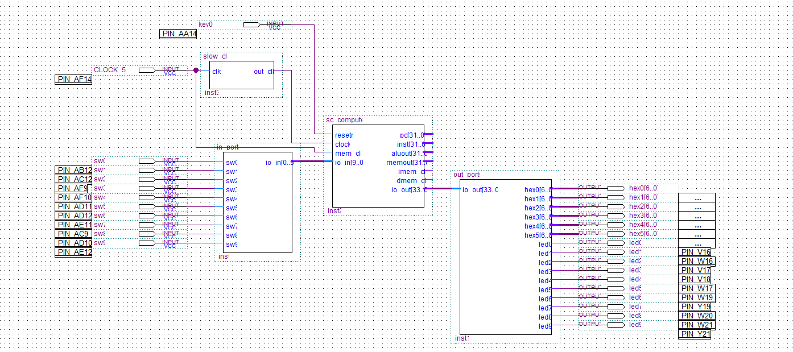
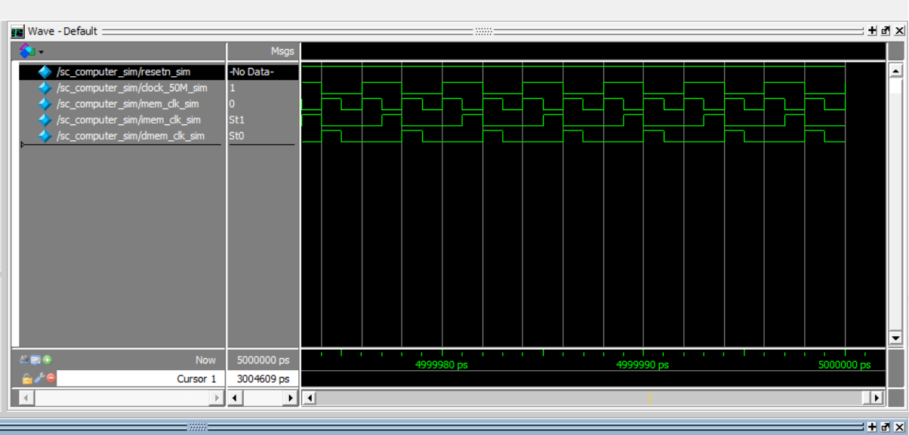
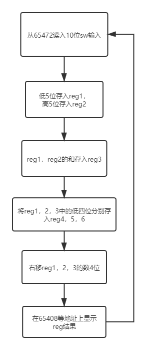

# 单周期cpu实验报告
518021911058 沈瑜石

## 实现代码
### 顶层文件


### cu
```verilog
module sc_cu (op, func, z, wmem, wreg, regrt, m2reg, aluc, shift,
              aluimm, pcsource, jal, sext);
input  [5:0] op,func;
input        z;
output       wreg,regrt,jal,m2reg,shift,aluimm,sext,wmem;
output [3:0] aluc;
output [1:0] pcsource;
wire r_type = ~|op;
wire i_add = r_type & func[5] & ~func[4] & ~func[3] &
     ~func[2] & ~func[1] & ~func[0];          //100000
wire i_sub = r_type & func[5] & ~func[4] & ~func[3] &
     ~func[2] &  func[1] & ~func[0];          //100010

wire i_and = r_type & func[5] & ~func[4] & ~func[3] &
     func[2] & ~func[1] & ~func[0];           //100100
wire i_or  = r_type & func[5] & ~func[4] & ~func[3] &
     func[2] & ~func[1] & func[0];           //100101
wire i_xor = r_type & func[5] & ~func[4] & ~func[3] &
     func[2] & func[1] & ~func[0];           //100110
wire i_sll = r_type & ~func[5] & ~func[4] & ~func[3] &
     ~func[2] & ~func[1] & ~func[0];           //000000
wire i_srl = r_type & ~func[5] & ~func[4] & ~func[3] &
     ~func[2] & func[1] & ~func[0];           //000010
wire i_sra = r_type & ~func[5] & ~func[4] & ~func[3] &
     ~func[2] & func[1] & func[0];           //000011
wire i_jr  = r_type & ~func[5] & ~func[4] & func[3] &
     ~func[2] & ~func[1] & ~func[0];           //001000
wire i_addi = ~op[5] & ~op[4] &  op[3] & ~op[2] & ~op[1] & ~op[0]; //001000
wire i_andi = ~op[5] & ~op[4] &  op[3] &  op[2] & ~op[1] & ~op[0]; //001100

wire i_ori  = ~op[5] & ~op[4] &  op[3] &  op[2] & ~op[1] & op[0]; //001101
wire i_xori = ~op[5] & ~op[4] &  op[3] &  op[2] & op[1] & ~op[0]; //001110
wire i_lw   = op[5] & ~op[4] &  ~op[3] &  ~op[2] & op[1] & op[0]; //100011
wire i_sw   = op[5] & ~op[4] &  op[3] &  ~op[2] & op[1] & op[0]; //101011
wire i_beq  = ~op[5] & ~op[4] &  ~op[3] & op[2] & ~op[1] & ~op[0]; //000100
wire i_bne  = ~op[5] & ~op[4] &  ~op[3] & op[2] & ~op[1] & op[0]; //000101
wire i_lui  = ~op[5] & ~op[4] &  op[3] & op[2] & op[1] & op[0]; //001111
wire i_j    = ~op[5] & ~op[4] &  ~op[3] & ~op[2] & op[1] & ~op[0]; //000010
wire i_jal  = ~op[5] & ~op[4] &  ~op[3] & ~op[2] & op[1] & op[0]; //000011


assign pcsource[1] = i_jr | i_j | i_jal;
assign pcsource[0] = ( i_beq & z ) | (i_bne & ~z) | i_j | i_jal ;

assign wreg = i_add | i_sub | i_and | i_or   | i_xor  |
       i_sll | i_srl | i_sra | i_addi | i_andi |
       i_ori | i_xori | i_lw | i_lui  | i_jal;

assign aluc[3] = i_sra;
assign aluc[2] = i_sub | i_or | i_srl | i_sra | i_ori | i_lui | i_beq | i_bne;
assign aluc[1] = i_xor | i_sll | i_srl | i_sra | i_xori | i_lui;
assign aluc[0] = i_and | i_or | i_sll | i_srl | i_sra | i_andi | i_ori;
assign shift   = i_sll | i_srl | i_sra ;

assign aluimm  = i_addi | i_andi | i_ori | i_xori | i_lw | i_sw | i_lui;
assign sext    = i_addi | i_lw | i_sw | i_beq | i_bne;
assign wmem    = i_sw;
assign m2reg   = i_lw;
assign regrt   = i_addi | i_andi | i_ori | i_xori | i_lw | i_lui;
assign jal     = i_jal;

endmodule

```
### alu
```verilog
module alu (a,b,aluc,s,z);
   input [31:0] a,b;
   input [3:0] aluc;
   output [31:0] s;
   output        z;
   reg [31:0] s;
   reg        z;
   always @ (a or b or aluc) 
      begin                                   // event
         casex (aluc)
             4'bx000: s = a + b;              //x000 ADD
             4'bx100: s = a - b;              //x100 SUB
				 4'bx001: s = a & b;              //x001 AND
             4'bx101: s = a | b;              //x101 OR
             4'bx010: s = a ^ b;              //x010 XOR
             4'bx110: s = a << 16;            //x110 LUI: imm << 16bit             
             4'b0011: s = b << a;             //0011 SLL: rd <- (rt << sa)
             4'b0111: s = b >> a;             //0111 SRL: rd <- (rt >> sa) (logical)
             4'b1111: s = $signed(b) >>> a;   //1111 SRA: rd <- (rt >> sa) (arithmetic)
             default: s = 0;
         endcase
         if (s == 0)  z = 1;
         else z = 0;         
      end      
endmodule 
```

### io
```verilog
module sc_datamem (addr,datain,dataout,we,clock,mem_clk,dmem_clk,
		io_in,io_out);
 
   input  [31:0]  addr;
   input  [31:0]  datain;
   
   input          we, clock,mem_clk;
   output [31:0]  dataout;
   output         dmem_clk;
	
	input	[9:0]	io_in;
	output	[23:0]	io_out;
   
   wire           dmem_clk;    
   wire           write_enable; 
	wire				write_mem_enable,write_io_enable;
	wire	[31:0]	mem_dataout,io_dataout;

   assign         write_enable = we & ~clock; 
   assign         dmem_clk = mem_clk & ( ~ clock) ; 
	assign			write_mem_enable=(~addr[7])&write_enable;
	assign			write_io_enable=addr[7]&write_enable;
   assign 			dataout = addr[7]?io_dataout:mem_dataout;
   lpm_ram_dq_dram  dram(addr[6:2],dmem_clk,datain,write_mem_enable,mem_dataout);
	my_io my_io_inst(addr[6:2],dmem_clk,datain,write_io_enable,io_dataout,io_in,io_out);
endmodule 
```
io_in为10位sw输入，io_out为6个4位的数字输出，通过sevenseg转化成7位。
10个led在sc_computer中直接和led输入相连，不受cpu控制，只是为了显示sw状态方便。
通过addr[7]选择是否为io地址，通过write_mem_enable控制lpm_ram_dq_dram和my_io模块是否写数据。
```verilog
module my_io(addr,dmem_clk,datain,write_io_enable,dataout,io_in,io_out);
input	[4:0]	addr;
input	[9:0]	io_in;
input [31:0] datain;
input dmem_clk,write_io_enable;
output [23:0] io_out;
output [31:0] dataout;

reg	[23:0]	io_out;
reg 	[31:0]	dataout;

always @ (posedge dmem_clk) // output
  if (write_io_enable)
    begin
		case (addr)
		5'b00000:
        io_out[3:0] <= datain[3:0];
      5'b00001:
        io_out[7:4] <= datain[3:0];
      5'b00010:
        io_out[11:8] <= datain[3:0];
      5'b00011:
        io_out[15:12] <= datain[3:0];
      5'b00100:
        io_out[19:16] <= datain[3:0];
      5'b00101:
			io_out[23:20] <= datain[3:0];
		default:
			io_out <= 0;
		endcase
	 end

always @ (posedge dmem_clk) // input
	begin
		case (addr)
      5'b10000:
        dataout <= io_in;
      default:
        dataout <= 0;
		endcase
	end
endmodule
```
把addr[7]为1的地址，通过addr[6:2]映射到不同io端口。其中addr[6]为0表示输出端口，为1表示输入端口。

##  模拟结果


## 加法mips汇编代码
```mips
# |    | used |   |
# | 24 |  6   | 2 |
# addr[7]: 0 -> mem
#          1 -> device
#              0 -> output
#              1 -> input
# addr             back 2 type
# 00000: hex0     65408
# 00001: hex1     65412
# 00010: hex2     65416
# 00011: hex3     65420
# 00100: hex4     65424
# 00101: hex5     65428
# 10000: sw0~9      65472

start:
# $0 is 0
    xor $0, $0, $0
    j main_loop
main_loop:  
# load 2 number to r1, r2
    lw $1, 65472($0)
    sra $2, $1, 5
    andi $1, $1, 31
# calculate sum
    add $3, $1, $2
# to hex
    andi $4, $1, 15
    sra $1, $1, 4
    andi $5, $2, 15
    sra $2, $2, 4
    andi $6, $3, 15
    sra $3, $3, 4
# show the result
    sw $4, 65408($0)
    sw $1, 65412($0)
    sw $5, 65416($0)
    sw $2, 65420($0)
    sw $6, 65424($0)
    sw $3, 65428($0)
    j main_loop
```

